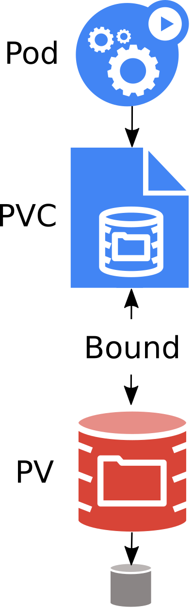
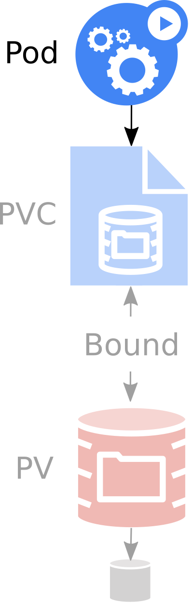
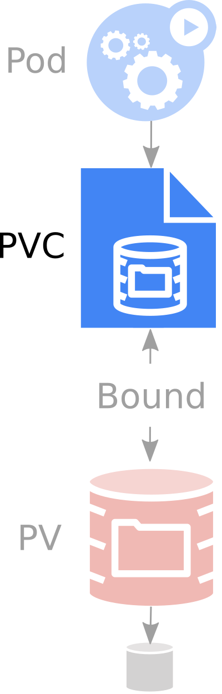
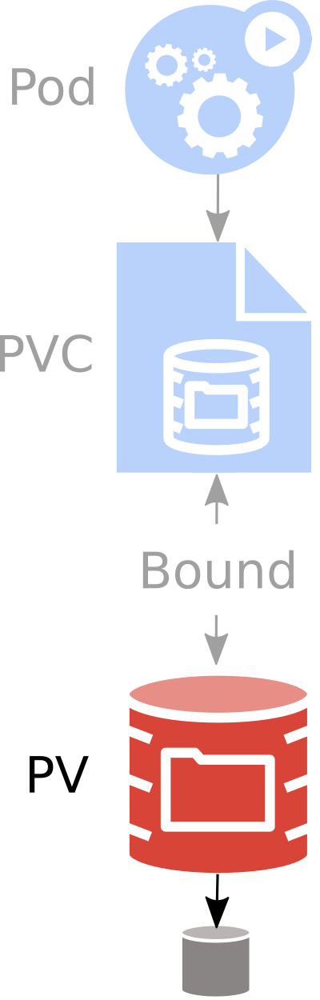
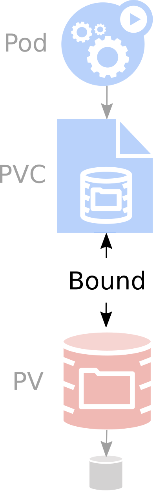
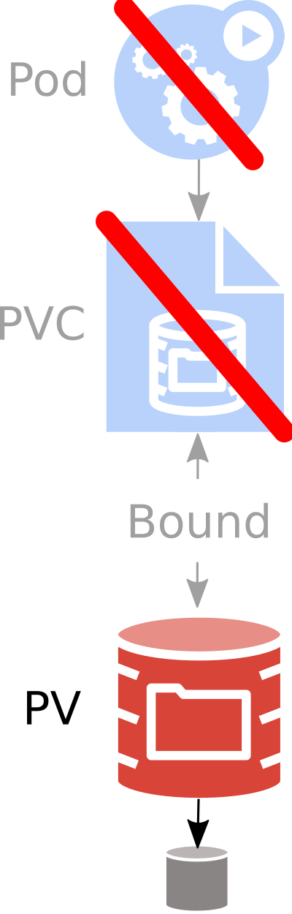
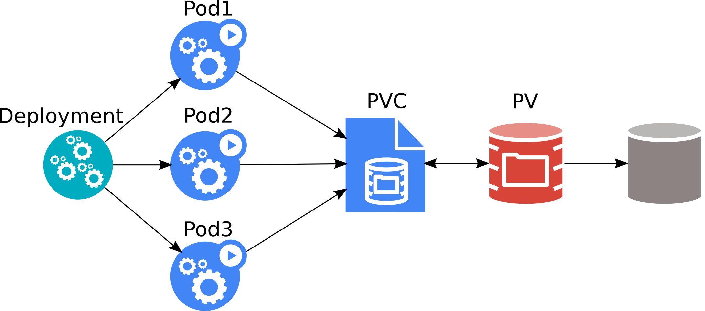
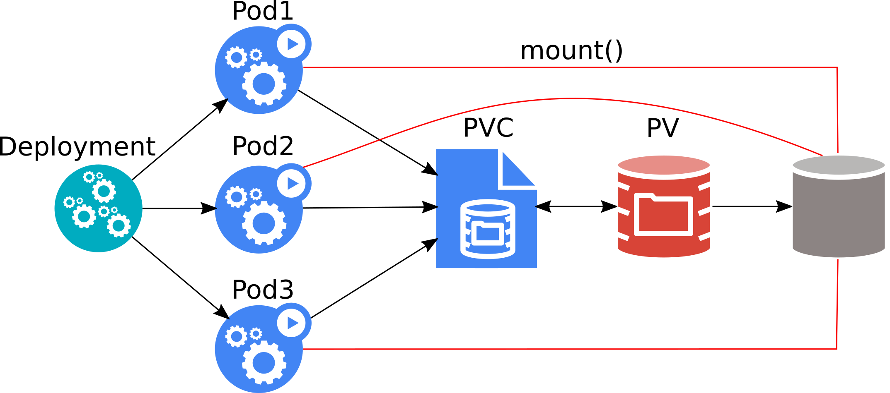
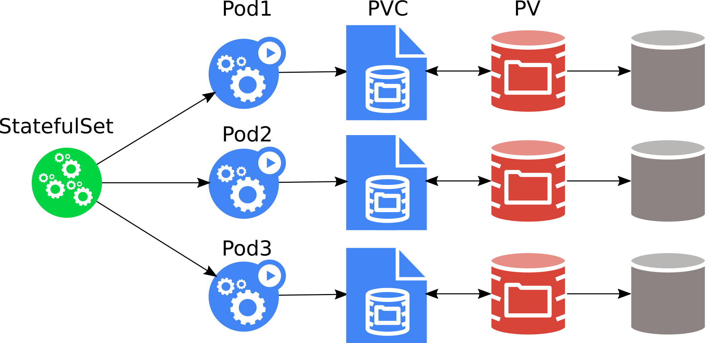

name: inverse
class: center, middle, inverse
layout: true

---

name: admin
class: top, left, admin
layout: true

---

name: user
class: top, left, user
layout: true

---

layout: true
class: top, left
<!-- the default layout -->

---

class: center, middle

# Kubernetes Storage 101
David Zhu, Google <br/>
Jan Šafránek, Red Hat

---

# Kubernetes

* ~~Container~~ Pod orchestrator.
  * Pod = one or more containers.
    * Containers are stateless.
      * Cleared on exit.
      * Unless a *persistent volume* is used.
---

template: user
# Pod

.column1_20[
  .center[
    <br/>
    `Pod`
  ]
]


```yaml
kind: Pod
apiVersion: v1
metadata:
  name: mysql
spec:
  containers:
  - image: mysql:5.6
    name: mysql
    ports:
    - containerPort: 3306
      name: mysql
    env:
    - name: MYSQL_ROOT_PASSWORD
      value: opensesame
```

* Database is lost when `mysql` container ends!

---

# Kubernetes Persistent Storage Objects

.column1_20[
  .center[
    <br/>
  ]
]

.column2[

**Pod**
* Mounts `PersistentVolumeClaim` into container(s).

**PersistentVolumeClaim (PVC)**
* Application request for storage.
* Created by user / devops.
* Binds to single PV.
* Usable in Pods.

**PersistentVolume (PV)**
* Pointer to physical storage.
* Binds to single PVC.
* Created by admin ("pre-provisioning").
* Created by Kubernetes on demand ("dynamic provisioning").
]

---

# Kubernetes Persistent Storage Objects Portability

.column1_20[
  .center[
    <br/>
  ]
]

.column2[
**Portable across Kubernetes clusters.**
  * Pod
  * PersistentVolumeClaim (PVC)

**Not portable across Kubernetes clusters.**
  * PersistentVolume (PV)
  * StorageClass
  * Both contain details about the storage:
      * Volume plugin.
      * IP addresses of storage server(s).
      * Paths.
      * Usernames / passwords.
      * ...
]

---

# Kubernetes Persistent Storage Objects

.column1_20[
  .center[
  
  ]
]

.column2[
`StorageClass`
* Collection of PersistentVolumes with the same characteristics.
  * "Fast", "Cheap", "Replicated", ...
* Parameters for dynamic provisioning.
* Created by admin.
* Subject of quota per namespace.
]

---

template: user
# Pod

.column1_20[
  .center[
    <br/>
  ]
]

.column2[
Mounts `PersistentVolumeClaim` into container(s).
```yaml
kind: Pod
apiVersion: v1
metadata:
  name: mysql
spec:
* volumes:
* - name: data
*   persistentVolumeClaim:
*     claimName: my-mysql-claim
  containers:
  - image: mysql:5.6
    name: mysql
    env:
    - name: MYSQL_ROOT_PASSWORD
      value: opensesame
*   volumeMounts:
*   - name:  data
*     mountPath: /var/lib/mysql
```
]

---

template: user
# PersistentVolumeClaim

.column1_20[
  .center[
    <br/>
  ]
]

.column2[
Request for storage.

```yaml
kind: PersistentVolumeClaim
apiVersion: v1
metadata:
  name: my-mysql-claim
spec:
  resources:
    requests:
      storage: 1Gi
  accessModes:
    - ReadWriteOnce
```
]

---

template: user
# PersistentVolumeClaim

.column1_20[
  .center[
    <br/>
  ]
]

.column2[
Request for storage.

```yaml
kind: PersistentVolumeClaim
apiVersion: v1
metadata:
  name: my-mysql-claim
spec:
* resources:
*   requests:
*     storage: 1Gi
  accessModes:
    - ReadWriteOnce
```

* *"Give me 1 GiB of storage."*
]

---

template: user
# PersistentVolumeClaim

.column1_20[
  .center[
    <br/>
  ]
]

.column2[
Request for storage.

```yaml
kind: PersistentVolumeClaim
apiVersion: v1
metadata:
  name: my-mysql-claim
spec:
  resources:
    requests:
      storage: 1Gi
* accessModes:
*   - ReadWriteOnce
```

* *"Give me 1 GiB of storage."*
* *"That is mountable to single pod as read/write."*
]
---

template: user
# PersistentVolumeClaim

.column1_20[
  .center[
    <br/>
  ]
]

.column2[
Request for storage.

```yaml
kind: PersistentVolumeClaim
apiVersion: v1
metadata:
  name: my-mysql-claim
spec:
  resources:
    requests:
      storage: 1Gi
  accessModes:
    - ReadWriteOnce
```

* *"Give me 1 GiB of storage."*
* *"That is mountable to single pod as read/write."*
* *"And I don't really care about the rest."*
]

---

template: user
# PVC creation

.column1_20[
  .center[
    <br/>
  ]
]

.column2[
```shell
$ kubectl create -f claim.yaml
persistentvolumeclaim/my-mysql-claim created

$ kubectl get pvc
NAME            STATUS VOLUME   CAPACITY ACCESS MODES STORAGECLASS AGE
my-mysql-claim  Bound  pvc-6428 1Gi      RWO          standard     26s
```
]

---

template: user
# Pod creation

.column1_20[
  .center[
    <br/>
  ]
]

.column2[
```shell
$ kubectl create -f pod.yaml
pod/mysql created

$ kubectl get pod
NAME    READY   STATUS    RESTARTS   AGE
mysql   1/1     Running   0          19s
```
]

---

template: user
# PVC debugging

```shell
$ kubectl get pvc
NAME              STATUS 
my-broken-claim   Pending
```

---

template: user
# PVC debugging

```shell
$ kubectl get pvc
NAME              STATUS 
my-broken-claim   Pending

*$ kubectl describe pvc
...
Events:
  Type       Reason              Age               From                         Message
  ----       ------              ----              ----                         -------
  Warning    ProvisioningFailed  8s (x4 over 53s)  persistentvolume-controller  storageclass.storage.k8s
.io "foo" not found

```

---

template: user
# Delayed binding

Depending on `StorageClass`, PVC binding may be delayed until the PVC is consumed by a pod.

```shell
$ kubectl get pvc
NAME              STATUS 
my-delayed-claim  Pending

$ kubectl describe pvc
...
Events:
  Type    Reason                Age   From                         Message
  ----    ------                ----  ----                         -------
  Normal  WaitForFirstConsumer  9s    persistentvolume-controller  waiting for first consumer to
be created before binding
```
--
```shell
$ kubectl create -f pod.yaml
pod/mysql created
```
--
```shell
$ kubectl get pvc
NAME              STATUS 
my-delayed-claim  Bound

```

---

template: admin
# PersistentVolume

.column1_20[
  .center[
    <br/>
  ]
]

.column2[
```yaml
apiVersion: v1
kind: PersistentVolume
metadata:
  name: pv1
spec:
* capacity:
*   storage: 2Gi
* accessModes:
*   - ReadWriteMany
*   - ReadWriteOnce
*   - ReadOnlyMany
* storageClassName: cheap
* persistentVolumeReclaimPolicy: Retain
  nfs:
    server: 192.168.121.1
    path: "/vol/share-1"
```

* Some metadata.

]

---

template: admin
# PersistentVolume

.column1_20[
  .center[
    <br/>
  ]
]

.column2[
```yaml
apiVersion: v1
kind: PersistentVolume
metadata:
  name: pv1
spec:
  capacity:
    storage: 2Gi
  accessModes:
    - ReadWriteMany
    - ReadWriteOnce
    - ReadOnlyMany
  storageClassName: cheap
  persistentVolumeReclaimPolicy: Retain
* nfs:
*   server: 192.168.121.1
*   path: "/vol/share-1"
```

* Pointer to storage.
  * AWS EBS, Azure DD, Ceph FS & RBD, CSI, FC, Flex, GCE PD, Gluster, iSCSI, NFS, OpenStack Cinder, Photon, Quobyte, StorageOS, vSphere

]

---

template: admin
# PersistentVolume

.column1_20[
  .center[
    <br/>
  ]
]

.column2[
```yaml
apiVersion: v1
kind: PersistentVolume
metadata:
  name: pv1
spec:
* capacity:
*   storage: 2Gi
  accessModes:
    - ReadWriteMany
    - ReadWriteOnce
    - ReadOnlyMany
  storageClassName: cheap
  persistentVolumeReclaimPolicy: Retain
  nfs:
    server: 192.168.121.1
    path: "/vol/share-1"
```

* Size of the volume.

]

---

template: admin
# PersistentVolume

.column1_20[
  .center[
    <br/>
  ]
]

.column2[
```yaml
apiVersion: v1
kind: PersistentVolume
metadata:
  name: pv1
spec:
  capacity:
    storage: 2Gi
* accessModes:
*   - ReadWriteMany
*   - ReadWriteOnce
*   - ReadOnlyMany
  storageClassName: cheap
  persistentVolumeReclaimPolicy: Retain
  nfs:
    server: 192.168.121.1
    path: "/vol/share-1"
```

* Access modes that the volume supports.

]

---

template: admin
# PersistentVolume

.column1_20[
  .center[
    <br/>
  ]
]

.column2[
```yaml
apiVersion: v1
kind: PersistentVolume
metadata:
  name: pv1
spec:
  capacity:
    storage: 2Gi
  accessModes:
    - ReadWriteMany
    - ReadWriteOnce
    - ReadOnlyMany
* storageClassName: cheap
  persistentVolumeReclaimPolicy: Retain
  nfs:
    server: 192.168.121.1
    path: "/vol/share-1"
```

* `StorageClass` where this volume belongs.

]

---

template: admin
# PersistentVolume

.column1_20[
  .center[
    <br/>
  ]
]

.column2[
```yaml
apiVersion: v1
kind: PersistentVolume
metadata:
  name: pv1
spec:
  capacity:
    storage: 2Gi
  accessModes:
    - ReadWriteMany
    - ReadWriteOnce
    - ReadOnlyMany
  storageClassName: cheap
* persistentVolumeReclaimPolicy: Retain
  nfs:
    server: 192.168.121.1
    path: "/vol/share-1"
```

* What to do when the volume is not needed any longer.
  * `Recycle` (deprecated), `Retain`, `Delete`
]

---

template: admin

# PersistentVolume Life Cycle: Creation

.column1_20[
  .center[
    <br/>
  ]
]

.column2[
* Pre-created PVs.
  * "Brownfield" scenarios (volumes with legacy data).
  * PV is `Available` until it matches a PVC. 
* Dynamic provisioning.
]

---

template: admin
# PersistentVolume Life Cycle: Binding

.column1_20[
  .center[
    <br/>
  ]
]

.column2[
When PVC is created:
* *Matching* PV exists: they're `Bound` together.
* No matching PV: dynamic provisioning.
  * Based on StorageClass.
* No matching PV && dynamic provisioning not possible / failed: PVC is `Pending`. 
]

---

template: admin
# PersistentVolume Life Cycle: Release

.column1_20[
  .center[
    <br/>
  ]
]

.column2[

PVC is deleted: `persistentVolumeReclaimPolicy` is executed:
  * `Recycle` (deprecated):
      * **All data from the volume are removed** ("`rm -rf *`").
      * PV is `Available` for new PVCs.
  * `Delete`:
      * **Volume is deleted in the storage backend.**
      * PV is deleted.
      * Usually for dynamically-provisioned volumes
  * `Retain`:
      * PV is kept `Released`.
      * **No PVC can bind to it.**
      * Admin should manually prune `Released` volumes.

In all cases, user can't access the data!

]

---

template: admin
# PersistentVolume Life Cycle: Release debugging

Debugging:

```shell
$ kubectl get pv
NAME         CAPACITY ACCESS MODES RECLAIM POLICY STATUS
pvc-e910afa9 1Gi      RWO          Delete         Failed
```

--

```shell
*$ kubectl describe pv
...
Events:
  Type    Reason             Age  From                        Message
  ----    ------             ---- ----                        -------
  Warning VolumeFailedDelete 66s  persistentvolume-controller Error deleting EBS volume "vol-045c"
since volume is currently attached to "i-0ad296cb18de65bf6"

```

---

template: admin
# PersistentVolume Life Cycle: Deletion

.column1_20[
  .center[
    <br/>
  ]
]

.column2[

* Automatic:
  * `persistentVolumeReclaimPolicy = Delete`.
* Manual:
  * PV is `Released`.
  * Does not delete volume on storage backend!
]

---

template: admin
# StorageClass

.column1_20[
  .center[
  
  ]
]

.column2[

```yaml
apiVersion: storage.k8s.io/v1
kind: StorageClass
metadata:
  name: fast
  annotations:
    storageclass.kubernetes.io/is-default-class: "true"
provisioner: kubernetes.io/aws-ebs
parameters:
  type: io1
  iopsPerGB: "50"
```

* Collection of PersistentVolumes with the same characteristics.
* Usually admin territory.
* Global, not namespaced.
]

---

template: admin
# StorageClass

.column1_20[
  .center[
  
  ]
]

.column2[

```yaml
apiVersion: storage.k8s.io/v1
kind: StorageClass
metadata:
  name: fast
  annotations:
    storageclass.kubernetes.io/is-default-class: "true"
*provisioner: kubernetes.io/aws-ebs
parameters:
  type: io1
  iopsPerGB: "50"
```

* Who dynamically provisions volumes.
  * Name of hardcoded volume plugin.
  * Name of external provisioner.
  * Name of CSI driver.
]

---

template: admin
# StorageClass

.column1_20[
  .center[
  
  ]
]

.column2[

```yaml
apiVersion: storage.k8s.io/v1
kind: StorageClass
metadata:
  name: fast
  annotations:
    storageclass.kubernetes.io/is-default-class: "true"
provisioner: kubernetes.io/aws-ebs
*parameters:
* type: io1
* iopsPerGB: "50"
```

* Parameters for dynamic provisioning.
  * Depend on the provisioner.
]

---

template: admin
# StorageClass

.column1_20[
  .center[
  
  ]
]

.column2[

```yaml
apiVersion: storage.k8s.io/v1
kind: StorageClass
metadata:
  name: fast
* annotations:
*   storageclass.kubernetes.io/is-default-class: "true"
provisioner: kubernetes.io/aws-ebs
parameters:
  type: io1
  iopsPerGB: "50"
```

* One `StorageClass` in the cluster can be default.
  * PVC without any `StorageClass` gets the default one.
]

---

template: inverse

# Stateful applications

---

template: user
# Pods are not for users

* Pod can be deleted.
  * Preemption.
  * Node is drained (for update, ...)  
  * Node goes down.

-> Users should not create Pod objects.

---

template: user
# Kubernetes hig-level objects

`Deployment`
* Runs X replicas of a single Pod template.
* When a pod is deleted, `Deployment` automatically creates a new one.
* Scalable up & down.
* All pods share the same PVC!

---

template: user
# Deployment
<br/>
.center[

]

---

template: user
# Deployment
<br/>
.center[

]

* All three pods can overwrite data of each other!
* Most applications crash / refuse to work.

---

template: user
# Kubernetes hig-level objects

`StatefulSet`
* Runs X replicas of a single Pod template.
  * Each pod gets its own PVC(s) from a PVC template.
* When a pod is deleted, `StatefulSet` automatically creates a new one.
* Each pod has a stable identity.
* Scalable up & down.

---

template: user
# StatefulSet
.center[

]
* The pods must be aware of their siblings!
* Usually very complex setup.
  
---

template: inverse
# Storage features

---

# [Topology aware scheduling](https://kubernetes.io/docs/concepts/storage/storage-classes/#volume-binding-mode)

* PV can be usable only by subset of nodes.
  * Cloud *regions* / *availability zones*.
  * Bare metal datacenters.
  * ...
* Pod must be scheduled:
  * Where the PV is reachable.
  * Where is enough resources to run the pod (CPU, memory, GPU, ...)

PV provisioning is delayed until Pod is created for scheduler to pick a node that matches both PV & Pod.

Wednesday, Hall 8.0 D2, 15:55: [Improving Availability for Stateful Applications in Kubernetes - Michelle Au](https://kccnceu19.sched.com/event/MPfh/improving-availability-for-stateful-applications-in-kubernetes-michelle-au-google)

---

# [Local volumes](https://kubernetes.io/blog/2018/04/13/local-persistent-volumes-beta/)

* Unused local disks can be used as PVs.
  * Extra speed.
  * Lower reliability.
  * No pod scheduling flexibility.

---

# [Raw block](https://kubernetes.io/blog/2019/03/07/raw-block-volume-support-to-beta/)

* Pods can get a block device of a PV.
  * For extra speed.
  * For software defined storage. 

---

# [Resize](https://kubernetes.io/docs/concepts/storage/persistent-volumes/#expanding-persistent-volumes-claims)

* Only expansion is supported.
* Offline.
* Online (alpha).

---

# [Container Storage Interface (CSI)](https://kubernetes-csi.github.io/docs/)


> *Industry standard that will enable storage vendors (SP) to develop a plugin once and have it work across a number of container orchestration (CO) systems.*

* No change from user perspective, Pods & PVCs as usual.

* Extra work for cluster admin.
  * New Kubernetes external components:
      * `external-attacher`
      * `external-provisioner`
      * `node-driver-registrar`
      * `cluster-driver-registrar`
      * `external-resizer`
      * `external-snapshotter`
      * ...

---

# Snapshots

* Alpha.
* Part of CSI.
* Can take a snapshot of PVC.
* PVC can be provisioned from a snapshot.

---

# [CSI migration](https://github.com/kubernetes/enhancements/blob/master/keps/sig-storage/20190129-csi-migration.md)

* Alpha.
* Remove in-tree volume plugins.
* Translate to CSI seamlessly.
 
---

template: inverse
# Summary

---

# Persistent Storage objects

.column1_20[
  .center[
    <br/>
  ]
]

.column2[
**Pod**
* Mounts `PersistentVolumeClaim` into container(s).

**PersistentVolumeClaim (PVC)**
* Application request for storage.
* Created by user / devops.

**PersistentVolume (PV)**
* Pointer to physical storage.
* Created by Kubernetes on demand ("dynamic provisioning").

**StorageClass**
* Collection of PersistentVolumes with the same characteristics.
* Parameters for dynamic provisioning.
]
---

template: inverse
# It's not all!

---

# Kubecon EU 2019

* David Zhu, Google & Jan Šafránek: [Tutorial: Back to Basics: Hands-On Deployment of Stateful Workloads on Kubernetes](https://kccnceu19.sched.com/event/MPgl/tutorial-back-to-basics-hands-on-deployment-of-stateful-workloads-on-kubernetes-david-zhu-google-jan-safranek-red-hat), Tue 11:05
* Josh Berkus: [Benchmarking Cloud Native Storage](https://kccnceu19.sched.com/event/MPcq/benchmarking-cloud-native-storage-josh-berkus-red-hat), Tue 11:55
* Saad Ali: [Debunking the Myth: Kubernetes Storage is Hard (keynote)](https://kccnceu19.sched.com/event/MQhi/keynote-debunking-the-myth-kubernetes-storage-is-hard-saad-ali-senior-software-engineer-google), Wed 9:58 
* Jared Watts: [Data Without Borders - Using Rook Storage Orchestration at a Global Scale](https://kccnceu19.sched.com/event/MPfq/data-without-borders-using-rook-storage-orchestration-at-a-global-scale-jared-watts-upbound), Wed 11:05
* Jared Watts & Bassam Tabbara: [Deep Dive: Rook](https://kccnceu19.sched.com/event/MPk3/deep-dive-rook-jared-watts-bassam-tabbara-upbound), Wed 11:55
* Iqbal Farabi & Tara Baskara: [Benchmarking Cloud Native Databases Performance on Kubernetes](https://kccnceu19.sched.com/event/MPfe/benchmarking-cloud-native-databases-performance-on-kubernetes-iqbal-farabi-tara-baskara-go-jek), Wed 11:55 
* Sheng Yang: [Build a Kubernetes Based Cloud Native Storage Solution From Scratch](https://kccnceu19.sched.com/event/MPXK/build-a-kubernetes-based-cloud-native-storage-solution-from-scratch-sheng-yang-rancher-labs), Wed 12:30
* Federico Lucifredi & Sébastien Han: [Rook, Ceph, and ARM: A Caffeinated Tutorial](https://kccnceu19.sched.com/event/MPfn/rook-ceph-and-arm-a-caffeinated-tutorial-federico-lucifredi-sebastien-han-red-hat), Wed 16:45
* Michelle Au: [Improving Availability for Stateful Applications in Kubernetes](https://kccnceu19.sched.com/event/MPfh/improving-availability-for-stateful-applications-in-kubernetes-michelle-au-google), Wed 15:55
* Saad Ali: [Intro + Deep Dive: Kubernetes Storage SIG](https://kccnceu19.sched.com/event/MPlJ/intro-deep-dive-kubernetes-storage-sig-saad-ali-google), Thu 11:05

---

# Reach out

[Kubernetes SIG Storage](https://github.com/kubernetes/community/tree/master/sig-storage)
* [Bi-weekly meetings](https://docs.google.com/document/d/1-8KEG8AjAgKznS9NFm3qWqkGyCHmvU6HVl0sk5hwoAE/edit?usp=sharing)
* [Slack](https://kubernetes.slack.com/messages/sig-storage)
* [Mailing list](https://groups.google.com/forum/#!forum/kubernetes-sig-storage)

---

template: inverse
# Questions?

---

# Junkyard

---
# Complex `PersistentVolumeClaim`

.column1_20[
  .center[
    <br/>
  ]
]

.column2[
```yaml
kind: PersistentVolumeClaim
apiVersion: v1
metadata:
  name: my-claim
spec:
  resources:
    requests:
      storage: 1Gi
* storageClassName: cheap
  accessModes:
    - ReadWriteOnce
    - ReadOnlyMany
  volumeMode: Block
```

* *"Give me 1 GiB of storage."*
* "*Of something `cheap`."*
]
---

# Complex `PersistentVolumeClaim`

.column1_20[
  .center[
    <br/>
  ]
]

.column2[
```yaml
kind: PersistentVolumeClaim
apiVersion: v1
metadata:
  name: my-claim
spec:
  resources:
    requests:
      storage: 1Gi
  storageClassName: cheap
* accessModes:
*   - ReadWriteOnce
*   - ReadOnlyMany
  volumeMode: Block
```

* *"Give me 1 GiB of storage."*
* *"Of something `cheap`."*
* *"And is usable in single pod as read/write or in several pods as read only."*
]

---

# Complex `PersistentVolumeClaim`

.column1_20[
  .center[
    <br/>
  ]
]

.column2[
```yaml
kind: PersistentVolumeClaim
apiVersion: v1
metadata:
  name: my-claim
spec:
  resources:
    requests:
      storage: 1Gi
  storageClassName: cheap
  accessModes:
    - ReadWriteOnce
    - ReadOnlyMany
* volumeMode: Block
```

* *"Give me 1 GiB of storage."*
* *"Of something `cheap`."*
* *"And is usable in single pod as read/write or in several pods as read only."*
* *"And is presented in Pods as a raw [block device](https://kubernetes.io/blog/2019/03/07/raw-block-volume-support-to-beta/)."*
]

---

# PersistentVolume

.column1_20[
  .center[
    <br/>
  ]
]

.column2[
```yaml
apiVersion: v1
kind: PersistentVolume
metadata:
  name: pv1
spec:
  capacity:
    storage: 2Gi
  accessModes:
    - ReadWriteMany
    - ReadWriteOnce
    - ReadOnlyMany
  storageClassName: cheap
  persistentVolumeReclaimPolicy: Retain
* volumeMode: Filesystem
  mountOptions:
    - "
    nfsvers=3"
  nfs:
    server: 192.168.121.1
    path: "/vol/share-1"
```

* How the volume can be accessed.
  * `Filesystem` (default), `Block`
]

---

# PersistentVolume

.column1_20[
  .center[
    <br/>
  ]
]

.column2[
```yaml
apiVersion: v1
kind: PersistentVolume
metadata:
  name: pv1
spec:
  capacity:
    storage: 2Gi
  accessModes:
    - ReadWriteMany
    - ReadWriteOnce
    - ReadOnlyMany
  storageClassName: cheap
  persistentVolumeReclaimPolicy: Retain
  volumeMode: Filesystem
* mountOptions:
*   - "nfsvers=3"
  nfs:
    server: 192.168.121.1
    path: "/vol/share-1"
```

* List of additional mount options.
]

---

Features:
- inline volumes
- subpath?
